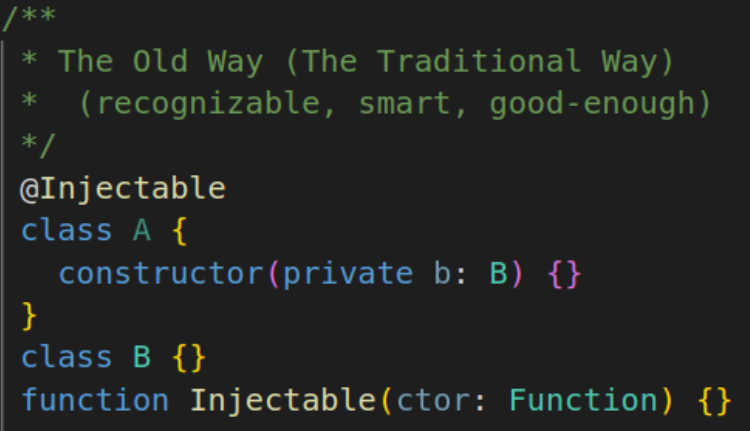
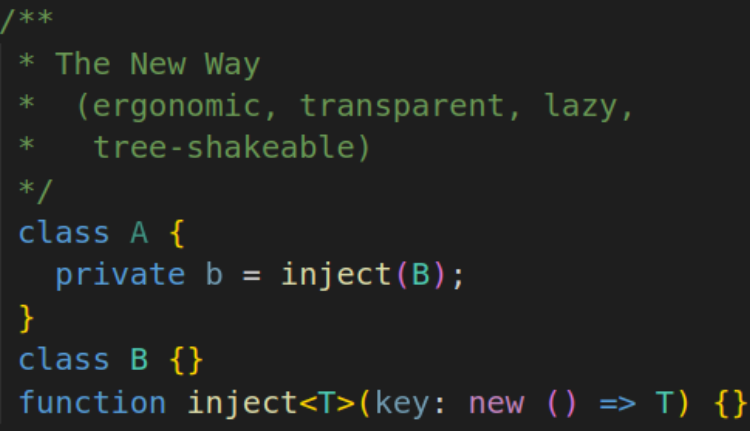
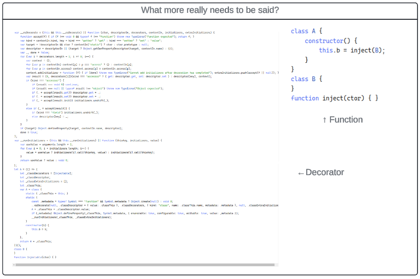

# Why an inject function?

## The Old Way



Traditionally, a dependency injector is implemented with something like the
above example.

A decorator preprocesses your annotated class, using native or imported
reflection capabilities to examine the constructor dependencies of the decorated
class, and saves off a mapping from a given type to it's direct dependencies,
along with whatever other metadata is needed.

This pattern is simple enough, and most closely resembles Dependency Injection
(the pattern).

## The New Way



In contrast, I think its obvious that using an `inject` function is at least a
little clearer and more ergonomic. It's just as expressive at the syntax level,
with even less boilerplate "noise". As it happens, at least in TS/JS, this also
benefits from being more tree-shakeable, and having a smaller footprint once
compiled. That means it's quite a bit easier to examine and debug as well.



### Setting expectations

```typescript
function inject(...)
```

Let's be clear about what we expect this to do: _if we are in an injection
context_, this function will give us whatever we ask for. What is an injection
context? **Things that happen within a call to `injector.get`.** So long as we
have a concrete instance of an injector, and the first request came through "the
front door", as it were, `inject` will be primed to serve whatever we ask it
for.

> **NEXT** - [Singletons](../v1/SINGLETONS.md)
