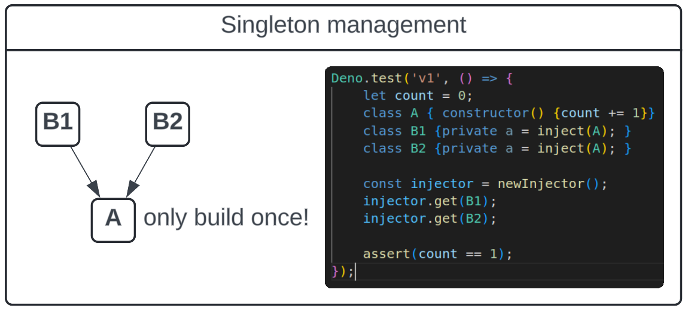

# The first point of interest: singleton management

An injector, first and foremost, acts as a unified registry of singletons.

That means that so long as you're using one, if any two classes depend on the
same type, you can guarantee that only one instance of that type will be
created.



Global state is famously yucky, but wrestling it into a box like an injector is
at least a little more responsible.

> **_NOTE:_** Some use cases might prefer to build singletons like this
> _eagerly_, but our implementation will focus on lazy construction. One reason
> to prefer this is that, as we'll see later, if you want eagerly constructed
> objects, you can still do that fairly easly with a lazy injector.

## What if I don't want singletons?

What if I just want instances that _rely_ on singletons? Well, the `inject`
paradigm is ready to help us here, too.

So long as we're within an injection context, its trivial to call `new` on an
injectable type:

```typescript
class A {
    private widgets: Widget[];
    constructor() {
        const count = inject(WidgetCountKey);
        for (let i = 0; i < count; i++) {
            this.widgets.push(new Widget());
        }
    }
}
class Widget {
    private widgetSecrets = inject(WidgetSecrets);
}
```

**_NOTE:_** Recognize that in doing this class `A` takes full responsibility for
the management of it's `Widget`'s. The injector does not store them.
