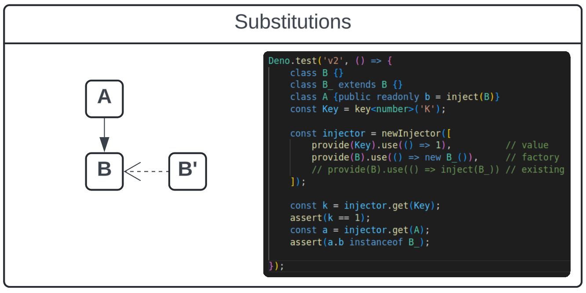

# Making a dependency injector true to it's name

## Substitution

Singleton management isn't enough.

Typically, the reason we turn to a dependency _injector_ is because we want to
use classic dependency _injection_. And that means the ability to substitute
dependencies with alternate implementations.

This is frequently useful for a variety of reasons. A simple example: you want
to write unit tests for a class that depend on a `NetworkClient` to communicate
over the internet. However, your tests are meant to be isolated from the
network, so you write a `MockNetworkClient` that swallows requests and spits out
spoofed responses.

## Expanding usefulness

An injector of this sort also gains a new capability: providing types beyond
simple constructable objects.

With this implementation, we can now define a `ProvideKey` associated with an
arbitrary primitive type, and pump raw configuration values into our injectable
classes with statements like `provide(NumKey).useValue(23)`.

## Kinds of substitution

To finally clarify just what it is we need out of this injector, lets commit to
an interface:

`provide(A).useExisting(OtherA)` - for supplying a derived type that meets the
desired interface.

`provide(A).useValue(a)` - for supplying a previously built, concrete value, or
primitive.

`provide(A).useFactory(() => new A(args))` - for supplying an object that just
_needs_ more information to be constructed.

> **NEXT** - [Context](../v3/CONTEXT.md)
