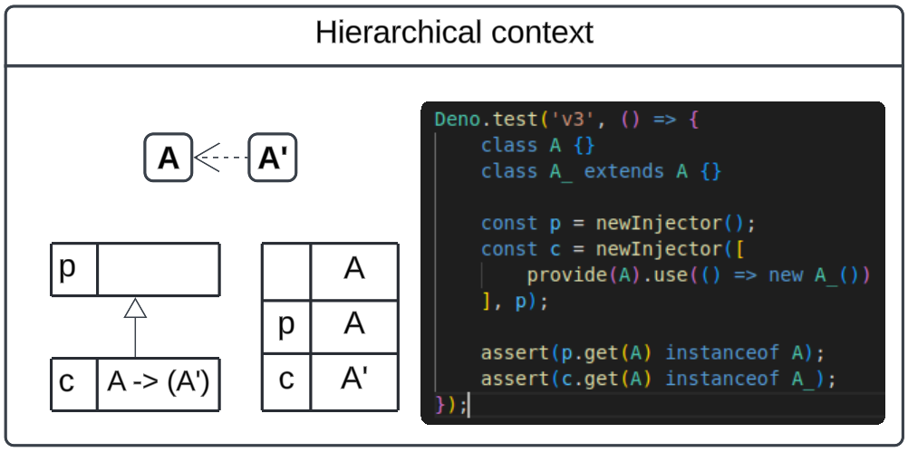
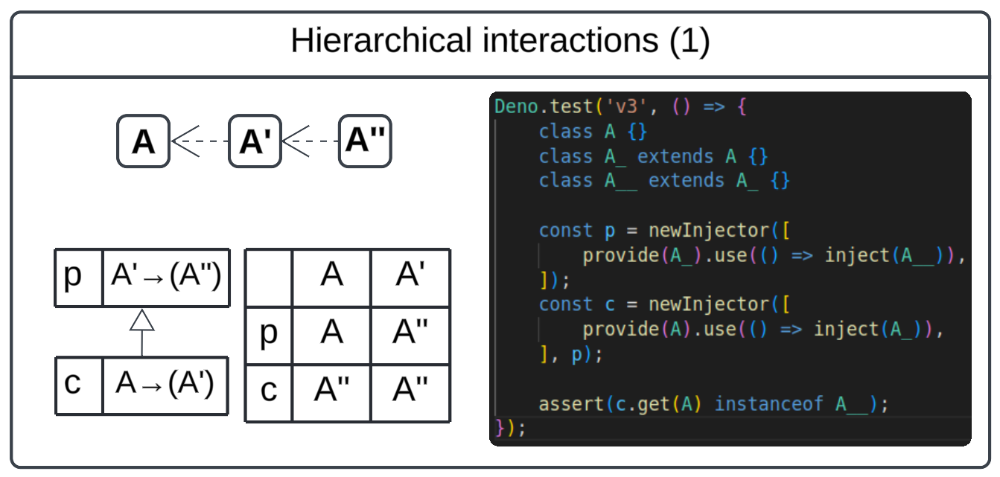

# Contextual configuration

Up to this point, we've built a very useful injector, capable of serving a wide
variety of meaningful applications. But, we can do better. We can define an
injector that understands _context_.

## Getting to know the family

Context, or scope, is usually relevant when we think of _narrowing_ it. We begin
from a broader, universal context, and work our way down to a context that is
"narrower", or _more specific_. Generally, we consider this context to be a
subset of the wider context, embedded within it.

In the world of injectors, that means an injector can have a "parent", to whom
it kicks back requests on which the first injector is not opinionated. Consider
an example:



Here we have an injector `p`, and its more specific child `c`. The child
injector is configured with a specific preference: when an instance of `A` is
requested, return an instance of `A'` instead.

So, if you ask the parent (or root) injector for an `A`, you will get an `A`,
but in the narrower context, the child injector gives you an `A'` instead.

### Respecting your elders

The previous example is probably pretty clear in how requests should be served
by any given injector in the hierarchy, but it's also useful to highlight a
subtle but important property.

What should a child injector do with a request for something it's not configured
to substitute? What should happen with a request for something that _no one_ is
configured to substitute? You know, _probably the most frequent, default case_.

The answer is that they should pass the request up the chain! And ultimately, if
no one has any opinion, that's a good indicator that there is only one _kind_ of
this thing that we are requesting--in the whole "universe"--and we should build
it and cache it once and for all. _In the root_.

Yes, storage. That is what we must consider. Injectors make things, but who
_holds_ those things? The most opinionated injector, and failing that, the
parent-most injector.

## A note on interesting interactions

In the previous version, we introduced a pattern for substituting types.

```typescript
provide(A).useExisting(OtherA);
```

In an injector hierarchy, we need to be more precise about what this means.
Consider a `useExisting` as a _re-key_. Meaning, if we request type `A`, then
what actually happens is the injector starts over as if you had requested
`OtherA` instead.

This may seem arbitrary, but it serves an important function; without it--say
you relied on a factory instead--then two classes within the same context could
end up with different objects unintentionally:

```typescript
class First {
    private a = inject(A);
}
class Second {
    private a = inject(OtherA);
}
```

The `First` class is not picky; it just needs an `A`. But the second knows that
what it needs is an `OtherA`. In a context where
`provide(A).useExisting(OtherA)` is active, these two classes might receive
`different` instances of `OtherA`. That can be a problem for a variety of
reasons, but first of all it breaks our first promise: that the injector should
provides singleton.

This paradigm can lead to some pretty sophisticated interactions between
injectors.



Stare at that for a minute, then zero in on the table. If you ask an injector
`x` for type `Y`, what will you get? Asking `p` for an `A` gets you a simple
`A`, but asking _`c`_ for it takes you on a _journey_. First, substitute for an
`A'`, but then `p` chimes in to say its going to be an `A''` instead!

> **NEXT** - [Correctness](../v4/CORRECTNESS.md)