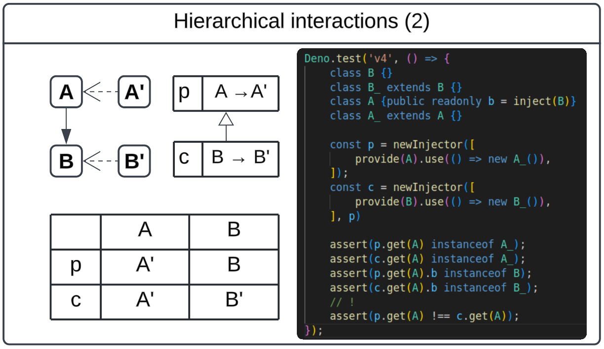
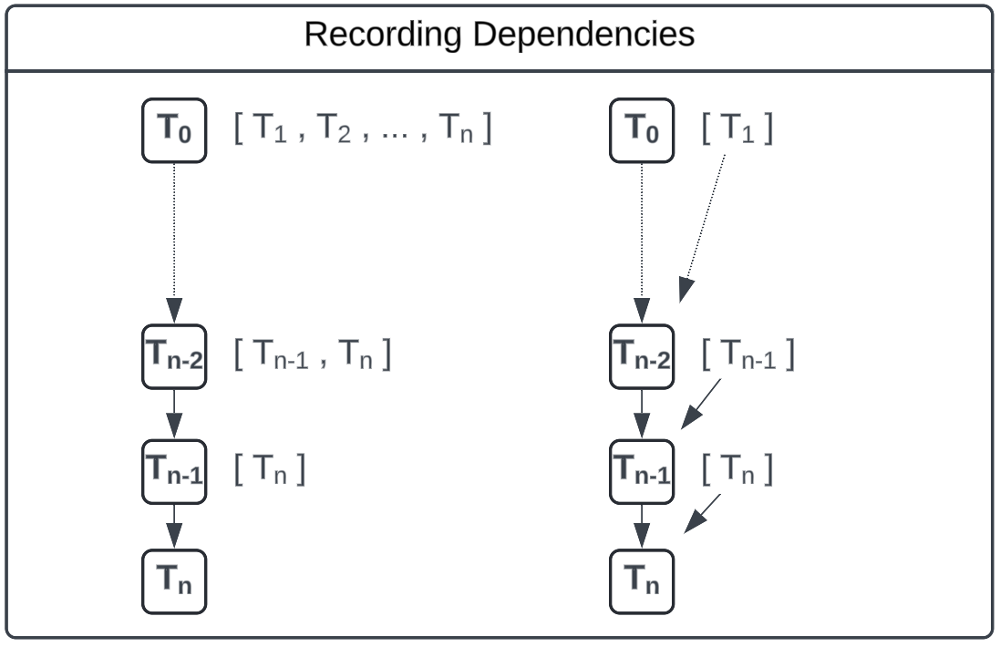
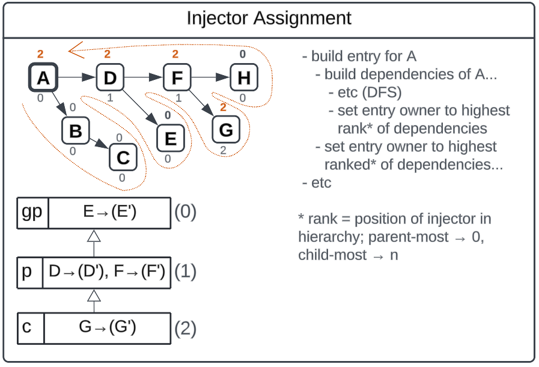

# Confessions

The previous injector is _powerful_. It is also a footgun. Consider an example:

Soak it in. What happens when we ask `c` for type `A`? Well, if you've been
following along, this request should kick back to the parent. But think further:
`A` depends on `B`, and `p` doesn't haven an opinion on `B`, so what you get is
a type `A'` with a reference to an instance of `B`.

_But that's not really what we want, is it?_

Lets clarify the problem with a case study:

You're writing a test again. Its a test for your important class `Thingamajig`,
which itself is an implementation of the abstract `ThingamajigInterface`.
Somewhere in the class hierarchy of `Thingamajig` is our beloved
`NetworkClient`, and as we've previously established, we don't want our test
talking to the internet, so, we mock out the client with our trusty
`provide(NetworkClient).useExisting(MockNetworkClient)`.

Now, imagine that your shiny injector effectively just _ignores_ this
configuration. (Hope you didn't need that extra foot...)

## `inject`'s dirty secret

So, what we need is for our injector to intelligently evaluate the (transitive!)
dependencies of whatever we're asking it to build when it makes it's decision
about _who_ should be building and storing this thing.

And this is where we finally run into the tradeoff of the `inject` function:
because we have no foreknowledge of dependencies, our injector simply doesn't
know this stuff up front.

But that doesn't mean it will _never_ know.

After all, _once we build a thing_ we ought to know what got built, right? If we
could just peel back the call stack and look inside, we could see very plainly
what our request depends on (transitively!).

And it turns out this isn't all that hard to do. With the help of some global
state, a global stack (or, more elegantly, a global value we save off in each
call stack frame), we can keep a record of "what did we build?" withing each
call to `inject` or `.get`. As long as we "build" the object in the same
injector that serviced a `.get`, we can automatically lean on the narrowest
configuration requirement represented by our context, and decide after the fact
which injector weighed in on the process.

> **_NOTE:_** The most obvious solution for our dependency record would be for
> each Entry to store a list of its transitive dependencies; that way we can
> just grab any Entry and immediately consult its list for the information we
> need. But this actually has a problem. Consider:
>
> 
>
> If we build up a complete list at each stage (as on the left), we're building
> a list that accumulates the content of every previous list. This quickly grows
> quadratically--in both time and space. Instead we can borrow a trick of
> immutable programming languages and just have each Entry hold references to
> dependencies, forming something a lot more like a linked list (or a tree).
> This gives us linear time building _and_ storing our record. _And_ it lets us
> iterate through these dependencies in multiple different ways, preserving the
> rich shape of an objects dependency hierarchy!

## Taking ownership

Knowing our dependencies is just half the battle; we also have to make sure that
the objects we build rely on this record to assign the right injector to own the
objects we build.

Luckily, this problem is very similar to the dependency recording problem
itself, and if we've never built an object before, its actually fairly trivial
to piggy-back on that process to figure out ownership.

To understand how it works though, we need to consider how exactly we're going
to tell in the heat of the moment "who should own this?" (We'll also stash a
reference in our Entry for whoever that is, for ease of access.)

#### Comparing injectors

Given two injectors that are each members of the same injector hierarchy, how
can we tell which one is "lower" (closer to the root) in that hierarchy? To this
point, our hierarchy is basically a linked list, so one method would be to
iterate through that list for each injector and see which one runs into the
other, or the root, first.

This would work of course, but we can do better.

Instead, lets say that as we build our injector hierarchy, we assign each
injector a "rank", telling us how far it is from the root. The root injector has
rank `0`, and it's child would be rank `1`, and so on. Now, comparison is a
trivial operation: just compare the ranks of any two injectors!

### Ownership on the fly

Using this ranking mechanism, we can now define our assignment algorithm:

In post-order fashion, whenever we've built something, use our global stack to
compare that thing to the object that may be waiting on it. An object's final
"owner" is simply whichever injector weighed in with the highest rank.

So, if each Entry has a reference to it's "owner", it's now very simple, as we
build objects, in a depth-first fashion, to make comparisons between the
"current owner" and "dependency owner". In every case, if the dependency is
owned by an injector of higher rank (farther from the root), then the dependent
object's owner is updated to the one of higher rank!

### Ownership on reflection

This is great for objects that have never been built, but for correctness' sake,
we also need to make sure things still work if an object has already been built
from a parent injector in the past; we have to be able to reflect on an
_existing_ dependency record and decide if we should _re-build_ a new copy of
the object to store in our _current_ injector.

Luckily, with our "on the fly" logic in place, we can reduce this question to an
even simpler variation: instead of very carefully determing "which injector
should own this?", we only need to answer "is there any injector with a narrower
opinion on this?", because if we can answer that question, we know we need to
re-build anyways, and our build logic is equipped to sort out the specific
question of ownership on it's own. _Huzzah._

#### Should we re-build?

Now, our dependency record becomes essential. Given a built Entry, which came
from _somewhere_ in our injector hierarchy (and conveniently holds a reference
to tell us where that is!), just depth-first-search through each of it's
transitive dependencies until you find one that is provided by a higher injector
than the one that previously built it. (That means we'll have to re-query for
that provide, starting from the child-most injector, to see if another provide
overshadow's the built one.)

And that's it! From that point, comparing ranks is trivial, and the first hit is
a sure sign that re-building is needed.

> **NEXT** - [Performance](../v5/PERFORMANCE.md)